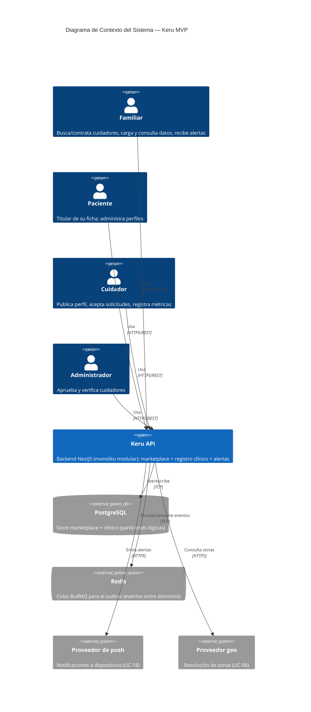

# Keru — Backend (MVP)

Keru es un **marketplace de cuidadores** ("el Uber de los cuidadores") que conecta pacientes y sus familias con cuidadores profesionales: buscarlos por zona/tipo/reputación, contratarlos en línea, **registrar las métricas de salud** del paciente durante el servicio y que la familia **consulte la evolución** y **reciba alertas** desde cualquier lugar.

Este repositorio es el **backend** (API REST). Los clientes (app móvil, web, back-office) se construyen aparte y consumen esta API.

> Los documentos de producto y gobernanza (casos de uso, scope, constitution, diseño IDesign residual y el skill `keru-feature`) viven en el repo paraguas **[`Keru`](https://github.com/EugeValeiras/Keru)**, que envuelve todos los sub-repos del proyecto.

- 📘 **Fuente de verdad de producto (casos de uso):** `Keru-Casos-de-Uso-MVP.md` (repo `Keru`)
- 📏 **Reglas no-negociables (arquitectura, NFRs, alcance):** `constitution.md` (repo `Keru`)
- 🏛️ **Diseño arquitectónico completo (IDesign residual):** `addl/docs/architect/residual-design.md` (repo `Keru`)
- 🔌 **Contrato de la API (OpenAPI):** [`openapi.json`](./openapi.json) · Swagger UI en `/api/docs`
- 🧭 **Flujo de trabajo para cambios:** skill `keru-feature` (docs-first, repo `Keru`)

---

## Estado del MVP

| Módulo | Casos de uso | Estado |
|---|---|---|
| **A — Membership** | UC-01 paciente · UC-02 cuidador · UC-03 invitación · UC-04 auth · UC-19 aprobación · UC-22 multi-perfil | ✅ |
| **B — Hiring** (marketplace) | UC-05 asignar · UC-06 buscar · UC-07 perfil · UC-08 favoritos · UC-09 solicitud/cierre · UC-10 aceptar · UC-16 historial | ✅ |
| **D+G — CareRecord** (clínico + alertas) | UC-12 vitales · UC-13 medicación · UC-18 alertas/campana · UC-20 novedad | ✅ |
| **E — CareConsult** (lectura) | UC-14 estado/historial · UC-15 gráficos | ✅ |
| **F — Reputation** | UC-17 calificar cuidador · UC-21 calificar paciente | ✅ |
| Base transversal | auth JWT, RolesGuard, envelope de errores, rate limiting, versionado `/api/v1`, CORS, catálogos, seed | ✅ |

Los **20 casos de uso del MVP** (UC-01..10, UC-12..22) están implementados y verificados con smoke tests en vivo. **UC-11 reservado** para pagos (fuera de alcance). API: **37 rutas** en `openapi.json`.

Circuito E2E funcionando: *registrarse → aprobar cuidador → buscar → contratar → aceptar → registrar dato clínico → alerta a la campana → consultar estado → finalizar → calificar (bidireccional)*.

---

## Arquitectura en una línea

**Monolito modular** (un solo deployable) organizado en **5 dominios** según arquitectura **IDesign residual**, con los límites preparados para **separar por deploy** el día que la escala lo pida (el primer split será la unidad clínica). Las reglas de llamada entre capas se **enforzan en CI** con ESLint (fitness functions).

| Dominio | Rol | Casos de uso |
|---|---|---|
| **Membership** | Alta, login, vínculos, aprobación de cuidadores | UC-01..04, UC-19, UC-22 |
| **Hiring** | Buscar, contratar, ciclo de vida + historial | UC-05..10, UC-16 |
| **CareRecord** ⭐ | Registro clínico + alertas (unidad protegida) | UC-12, UC-13, UC-18, UC-20 |
| **CareConsult** | Lectura clínica: estado, historial, gráficos | UC-14, UC-15 |
| **Reputation** | Reseñas bidireccionales | UC-17, UC-21 |

Capas IDesign: **Manager** (orquesta un workflow) → **Engine** (cálculo puro) → **ResourceAccess** (verbos atómicos sobre datos) → **Resource** (Postgres/Redis/externos), con **Utilities** transversales (PubSub/outbox, Audit). Detalle en [`constitution.md`](./constitution.md) §3.

---

## Diagrama de Contexto (C4 · nivel 1)



---

## Tecnología

| Capa | Elección | Por qué |
|---|---|---|
| Runtime | **Node.js 20** | LTS |
| Framework | **NestJS 11** (monorepo modular) | DI, módulos = límites de dominio, separable por deploy |
| Lenguaje | **TypeScript 5** | Tipado fuerte, decoradores |
| Base de datos | **PostgreSQL 16** | Relacional, JSONB, transaccional (outbox atómico) |
| ORM | **TypeORM 0.3** | Entidades + repos + transacciones |
| Colas / eventos | **Redis 7 + BullMQ** | Comunicación asíncrona entre dominios (ver abajo) |
| Auth | **JWT** (`@nestjs/jwt`) + **bcryptjs** | Sesión stateless por token, hash de password |
| Documentación API | **Swagger / OpenAPI** (`@nestjs/swagger`) | Contrato consumible por los clientes |
| Validación | **class-validator / class-transformer** | DTOs validados en el borde |
| Fitness functions | **ESLint + eslint-plugin-boundaries** | Enforzar las reglas de arquitectura en CI |

---

## ¿Cuándo y por qué se usa Redis?

Redis es el **backbone de la comunicación asíncrona entre dominios**, vía **BullMQ**. La regla de arquitectura es tajante: **un Manager nunca llama a otro Manager de forma síncrona** (constitution §3.2). Todo handoff entre dominios va **encolado**, sobre el patrón **outbox**:

1. El Manager emisor, **dentro de la misma transacción** que su cambio de estado, escribe el evento en la tabla `outbox_event` de Postgres (commit atómico — el evento no se pierde ni se emite "a medias").
2. Tras el commit, el evento se **encola en Redis (BullMQ)**.
3. Un worker consume la cola y **despacha** el evento al Manager suscriptor del otro dominio.

**Por qué Redis y no una llamada directa:** desacopla los dominios (cada uno puede fallar/escalar por separado), da **durabilidad y reintentos** al handoff, y habilita el futuro **split por deploy** sin cambiar el código de dominio (hoy los emisores/consumidores están en el mismo proceso; mañana en procesos distintos, misma cola).

### Flujos que usan Redis (eventos encolados)

> **Estado actual (importante):** en el monolito de un solo deploy, estos handoffs están **diseñados pero diferidos** — hoy cada dominio lee lo que necesita del otro **en vivo desde la misma base** (pull-on-demand), así que la infra de Redis/BullMQ está montada pero **ociosa**. Los eventos encolados se vuelven necesarios al separar en deploys distintos (un servicio ya no puede leer la base del otro). Ver `constitution.md` §3.

| Evento (diseñado) | De → A | Cuándo | Caso de uso |
|---|---|---|---|
| `membership.caregiver.deactivated` | Membership → Hiring | Se desactiva/revoca un cuidador; hay que cerrar su estado en vuelo (asignaciones, solicitudes) | ripple de desactivación (UC-19) |
| `hiring.assignment.activated` / `assignment.closed` | Hiring → CareRecord | Se acepta/cierra una contratación; habilita/inhabilita el registro clínico | UC-10 → UC-05 → UC-12 |
| `care-record.record.committed` | CareRecord → CareConsult | Se registró un dato clínico; alimenta la proyección de lectura | UC-12 → UC-14/15 |

> **Nota:** Redis **no** está en el camino crítico de una alerta clínica. El registro clínico + la obligación de alerta se escriben atómicos en Postgres (outbox); la evaluación de la alerta es síncrona in-line.

---

## Puesta en marcha (quickstart)

Requisitos: Docker (y Node 20 para el modo desarrollo).

### Opción A — Modo producción local (todo con Docker)

El profile `app` levanta el stack completo prod-like: **API containerizada** (build multi-stage) + **webapp compilada** (nginx) + infra (**Postgres + Redis + floci**, el emulador AWS local para SES/S3). La API recibe las env de AWS apuntando a floci; el nginx de la webapp proxya `/api` → API y `/media` → floci, igual que el proxy de dev.

```bash
docker compose --profile app up -d --build   # (o npm run app:up)
# Webapp en http://localhost:8080
# API en http://localhost:3000/api/v1 · Swagger en http://localhost:3000/api/docs
npm run seed                                  # datos de demo (requiere Node 20 + npm install)
docker compose --profile app down             # baja todo (o npm run app:down)
```

- El build de la webapp asume el repo **`Keru-Webapp` hermano** de este (`../Keru-Webapp`); si está en otra ruta, exportá `KERU_WEBAPP_DIR=<ruta>` antes del `up`.
- El compose fija el nombre de proyecto (`name: keru-api`): los contenedores y volúmenes son los mismos desde cualquier directorio, así que este modo **convive con la infra de la Opción B** (la toma en lugar de duplicarla). Ojo: la API containerizada publica el `:3000` — si tenés `npm run start:dev` corriendo, frenalo antes o exportá `API_PORT=3001` (la webapp no lo necesita: adentro de la red del compose la API siempre es `api:3000`).
- Circuito E2E completo contra este modo: en `Keru-Webapp`, `E2E_BASE_URL=http://localhost:8080 npm run e2e`.

### Opción B — Infra en Docker + API en local (desarrollo con hot reload)

```bash
# 1. Infra (Postgres + Redis + floci)
npm run infra:up

# 2. Dependencias
npm install

# 3. Variables de entorno (opcional: los defaults ya funcionan con la infra de arriba)
cp .env.example .env

# 4. Datos de demo (cuentas + un paciente)
npm run seed

# 5. Levantar la API en modo desarrollo (hot reload)
npm run start:dev
```

- API: `http://localhost:3000/api/v1`
- Swagger UI: `http://localhost:3000/api/docs`
- Regenerar el contrato estático: `npm run openapi` (escribe `openapi.json`)
- Bajar la infra: `npm run infra:down`

**Cuentas seedeadas** (password `S3gura!123`): `familiar@test.com`, `cuidador@test.com`, `admin@test.com`. Paciente demo: *Rosa Díaz* (vinculada a `familiar@test.com`).

### Ejemplo de flujo

```bash
B=http://localhost:3000/api/v1
TOKEN=$(curl -s -X POST $B/auth/login -H 'Content-Type: application/json' \
  -d '{"email":"familiar@test.com","password":"S3gura!123"}' | jq -r .accessToken)

curl $B/patients -H "Authorization: Bearer $TOKEN"          # UC-22: mis pacientes
curl $B/catalogs                                             # catálogos de referencia
```

---

## Convenciones para los clientes

- **Autenticación:** `Authorization: Bearer <token>` (obtenido en `POST /auth/login`).
- **Versionado:** todas las rutas cuelgan de `/api/v1`.
- **Idempotencia (NFR-34):** toda mutación lleva un `operationId` único provisto por el cliente; un reintento con el mismo valor no duplica el efecto.
- **Errores:** shape uniforme `{ statusCode, code, message, details?, path, timestamp }`. `code` es legible por máquina (`VALIDATION_ERROR`, `UNAUTHORIZED`, `FORBIDDEN`, `CONFLICT`, …).
- **Rate limiting:** límites por **IP** por minuto (ver tabla abajo). Superado el límite la API responde **429** con el envelope uniforme (`code: TOO_MANY_REQUESTS`); el cliente debe esperar y reintentar (backoff), no loopear.
- **Correlación (`x-request-id`):** toda respuesta lleva el header `x-request-id`. Si el cliente lo manda, la API lo propaga; si no, genera un uuid. Al reportar un error, adjuntar ese id: correlaciona con los logs del servidor.
- **Catálogos:** enums y catálogo de métricas (con unidad y rangos) en `GET /catalogs`, para dropdowns y validación del cliente.

### Límites de rate limiting

Protección contra fuerza bruta (por IP, ventana de 1 minuto):

| Superficie | Límite | Por qué |
|---|---|---|
| `POST /auth/login` · `POST /auth/signup` | **5/min** | Fuerza bruta de credenciales (UC-04) |
| `GET /invitations/:token` (preview pública, sin sesión) | **30/min** | Adivinación de tokens de invitación (UC-03) |
| Resto de la API | **100/min** | Techo general razonable para un cliente legítimo |
| Back-office interno (`admin/*`) | sin límite | Excluido: ya exige JWT + rol `admin` |

La fuente de verdad de los límites es `libs/core/src/throttling/throttling.config.ts` (guard global montado en `AppModule`). Nota de despliegue: detrás de un reverse proxy, configurar `trust proxy` para que la IP vista sea la del cliente y no la del proxy.

### Observabilidad: logs estructurados

Cada request emite **una línea JSON parseable** a stdout (sin pino: `docker logs api | jq` o cualquier colector la ingiere tal cual):

```json
{"ts":"2026-07-22T20:00:00.000Z","level":"info","msg":"request","requestId":"<uuid>","method":"GET","path":"/api/v1/marketplace/caregivers","statusCode":200,"durationMs":12.3,"accountId":"<si hay sesión>"}
```

Los 5xx emiten además una línea `level: "error"` con el **stack** y el mismo `requestId`, así un error reportado por un cliente se rastrea con el header `x-request-id` de su respuesta. Implementación: `libs/core/src/logging/` (middleware montado en `AppModule`, antes de los guards — hasta un 401/429 sale correlacionado).

---

## 📱 Para el agente que construye la app móvil

Todo lo que necesitás para armar el cliente móvil está acá + en las 2 fuentes que siguen. **Empezá por el contrato.**

### Fuentes (en este orden)
1. **`openapi.json`** (o Swagger UI en `/api/docs`) — el **contrato completo**: 37 endpoints, request/response schemas, ejemplos, y qué rol requiere cada uno (por el tag y el `bearer`). Es la fuente para generar el cliente HTTP.
2. **[`Keru-Casos-de-Uso-MVP.md`](./Keru-Casos-de-Uso-MVP.md)** — el **comportamiento esperado** de cada flujo (UC-01..22): pantallas, flujos alternativos, criterios de aceptación. Úsalo para saber *qué* pantalla hace *qué*.
3. Este README — decisiones transversales y las de abajo, que el contrato no cuenta.

### Autenticación (UC-04)
- `POST /auth/signup` `{ email, password, role, displayName }` → devuelve `{ accessToken, role, ... }`. `role` ∈ `patient | family | caregiver` (admin no se auto-registra).
- `POST /auth/login` → `{ accessToken, role, ... }`. Guardá el token y mandalo como `Authorization: Bearer <token>` en todo lo demás.
- El **rol define la navegación**: `family/patient` → marketplace + seguimiento; `caregiver` → agenda + registro de métricas; `admin` → back-office.

### Decisiones que SÍ o SÍ tenés que saber (el contrato no las dice)
| Tema | Cómo funciona en el MVP |
|---|---|
| **Notificaciones push** | **No hay push a dispositivo** (ni registro de device token, ni FCM/APNs). La **campana in-app es la fuente de verdad**: hacé *polling* de `GET /notifications/unread-count` (badge) y `GET /notifications` (lista). No busques un endpoint de push: no existe. |
| **"Tiempo real" (UC-14)** | Se resuelve con **polling** (no hay WebSocket/SSE). Refrescá estado/historial/campana con polling (ej. cada X seg en la vista abierta). Cada respuesta de lectura trae un `asOf` para mostrar frescura. |
| **Deep links de invitación (UC-03)** | `POST /patients/:id/invitations` devuelve `{ token, link, expiresAt }` (el link es `https://keru.app/invite/:token`). La app abre ese deep link, muestra el preview con `GET /invitations/:token`, y confirma con `POST /invitations/:token/confirm` (requiere estar logueado como el invitado). Vence a los **30 min**, un solo uso. |
| **Imágenes / archivos** | `photoUrl` (paciente) y certificaciones del cuidador son **URLs (strings)** — **no hay endpoint de upload**. El cliente hostea la imagen donde quiera (S3, Cloudinary, etc.) y pasa la URL. |
| **Idempotencia** | En toda **creación** (paciente, cuidador, solicitud, registro clínico) generá y mandá un `operationId` único (UUID). Si reintentás por corte de red, reusá el **mismo** `operationId` → no duplica. |
| **Errores** | Shape uniforme `{ statusCode, code, message, details?, path, timestamp }`. `code` es legible por máquina; en validación, `details.fields` trae el error por campo. |
| **Contexto de paciente (UC-22)** | Una cuenta administra 1..n pacientes. Toda operación por-paciente lleva el `patientId` en la ruta/body. La app debe tener un selector de paciente activo. |

### Lo que NO está en la API (diferido — no lo esperes)
- Push a dispositivo (arriba) · read model / websockets · subida de archivos.
- **Zonas**: son texto libre (`zone: string`); no hay autocompletado geográfico ni provincias.
- **Consentimiento legal** explícito (OQ-5 sin decidir) y **pagos online** (UC-11 reservado; en el MVP el pago es off-platform → `POST /hiring-requests/:id/complete` cierra la contratación).

### Cuentas de prueba
Corré `npm run seed` (ver Quickstart). Quedan: `familiar@test.com`, `cuidador@test.com`, `admin@test.com` (pass `S3gura!123`) + paciente demo *Rosa Díaz*.

---

## Estructura del repo

```
keru/
├── apps/keru-api/          # El deployable: compone los dominios, autorización, ops (barrido), seed, catálogos
├── libs/
│   ├── core/               # Infra compartida: TypeORM, TransactionUtility, outbox/PubSub (BullMQ), Audit, PermissionEngine, auth, errores
│   ├── membership/         # Dominio Membership (UC-01/02/03/04/19/22)
│   ├── hiring/             # Dominio Hiring (UC-05..10, UC-16)
│   ├── care-record/        # Dominio CareRecord (UC-12/13/18/20)
│   ├── care-consult/       # Dominio CareConsult (UC-14/15)
│   └── reputation/         # Dominio Reputation (UC-17/21)
├── constitution.md         # Reglas no-negociables
├── Keru-Casos-de-Uso-MVP.md# Fuente de verdad de producto
├── openapi.json            # Contrato de la API (generado)
└── docker-compose.yml      # Infra local (Postgres + Redis + floci) + profile app (API + webapp)
```

Cada dominio se organiza en `manager/`, `engine/`, `resource-access/` (capas IDesign). El límite entre capas lo verifica `npm run lint`.

---

## Scripts útiles

| Script | Qué hace |
|---|---|
| `npm run start:dev` | API con hot reload |
| `npm run build` | Compila el monorepo |
| `npm run lint` | Fitness functions (fronteras IDesign) + typescript-eslint |
| `npm run test` | Tests unitarios |
| `npm run seed` | Carga datos de demo |
| `npm run openapi` | Genera `openapi.json` |
| `npm run infra:up` / `infra:down` | Levanta/baja la infra (Postgres + Redis + floci) |
| `npm run app:up` / `app:down` | Modo producción local: infra + API + webapp en Docker |

---

## Cómo sumar features o cambios

Usar la skill **`keru-feature`** (docs-first): leer `constitution.md`, analizar el/los caso(s) de uso en [`Keru-Casos-de-Uso-MVP.md`](./Keru-Casos-de-Uso-MVP.md), documentar el cambio ahí **antes** de codear, escribir el test desde los criterios de aceptación, e implementar respetando las call rules. La spec del caso de uso es la fuente de verdad; el código se deriva de ella.
